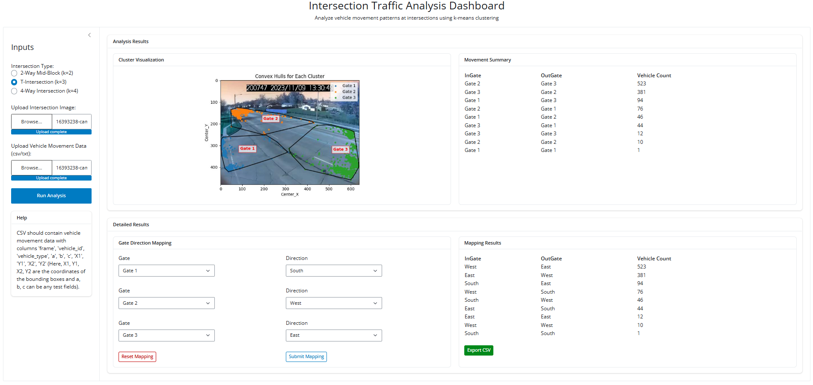

# Vehicle Movement Count

Vehicle movement count refers to the process of quantifying vehicle flows between defined entry and exit points—called gates—at an intersection. Each vehicle’s trajectory is tracked from its entry gate to its exit gate, and the system tallies how many vehicles move from one gate to another (e.g., from Gate 1 to Gate 3).

To simplify this process, I developed a Shiny App that takes an intersection image and vehicle trajectory data as input, automatically detects gates, and calculates the count of vehicles for each gate-to-gate movement. The app also has an option to map real-world directions (e.g., North, East) to the detected gates, allowing the dashboard to generate directional traffic counts. This intuitive interface enables users to visualize traffic flow patterns and export results for further analysis—making it a practical tool for traffic engineers and planners.



## 🛠️ Installation

```bash
# Clone the repo
https://github.com/anchalab/vehicle-movement-count.git

cd vehicle-movement-count

# Install dependencies
pip install -r requirements.txt

cd code

# Run the application
python app.py
